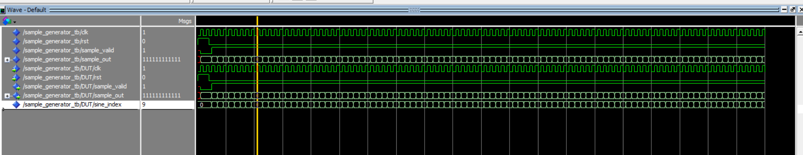
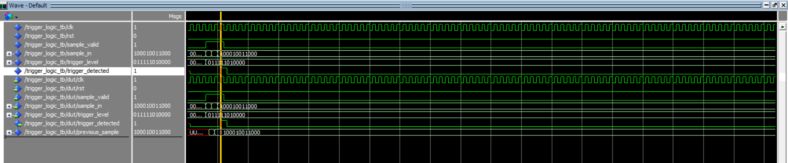
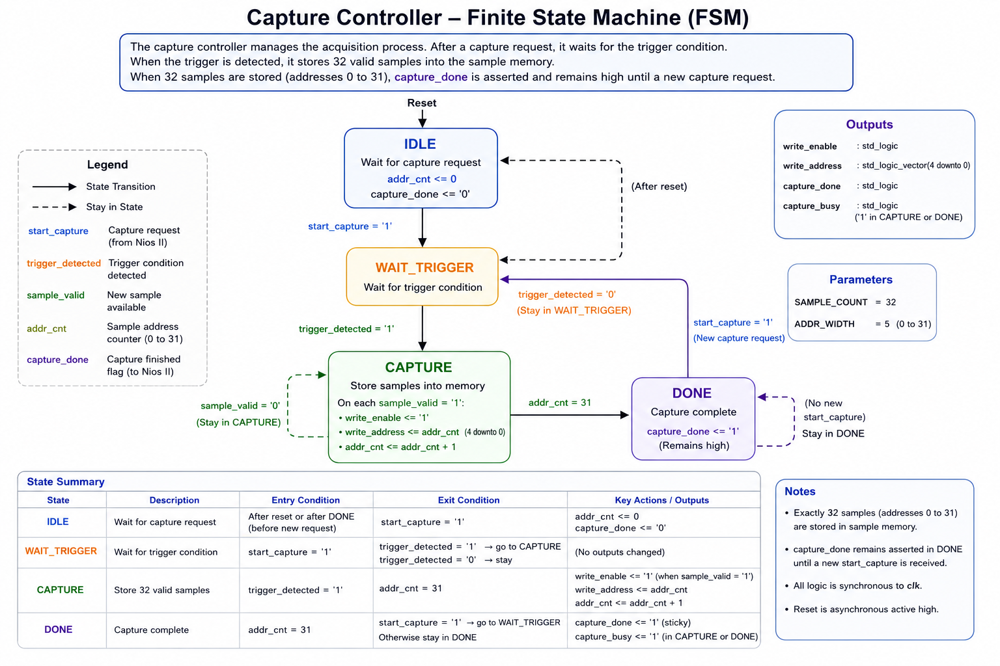
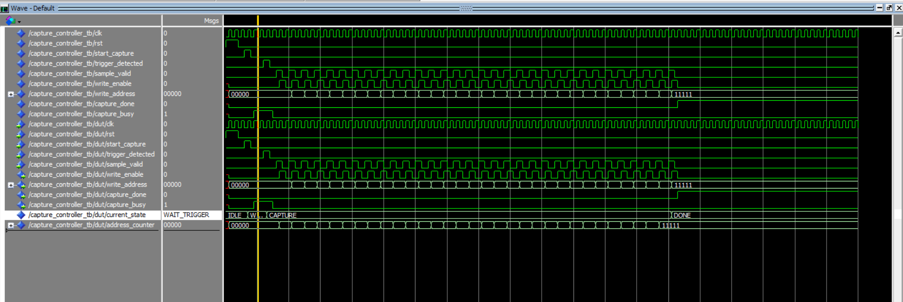
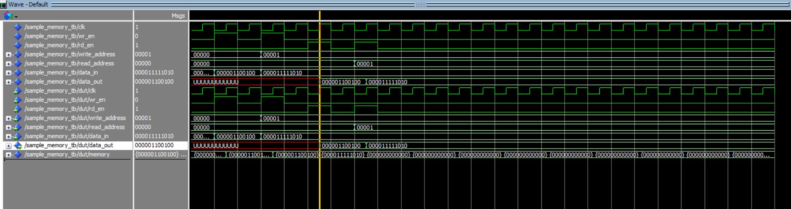
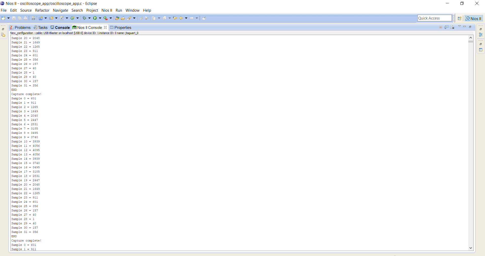
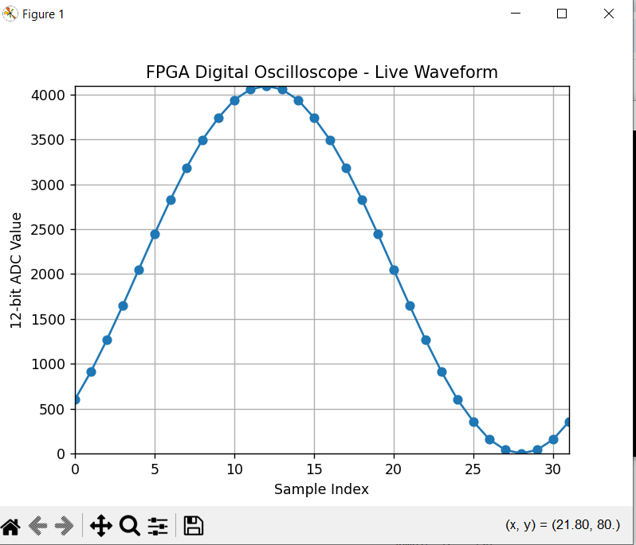
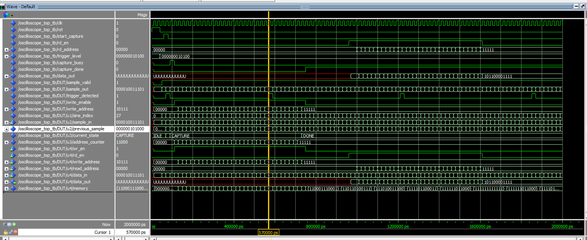

# FPGA Digital Oscilloscope with Nios II

A hardware/software data-acquisition system implemented on the **Terasic DE10-Lite FPGA board**, combining **VHDL RTL design, trigger-based sample capture, on-chip memory, Avalon-MM communication, Nios II embedded software, and Python waveform visualization.**

## System Overview

The oscilloscope captures a 12-bit waveform when a programmable trigger condition is detected. A hardware capture controller stores 32 samples in on-chip memory. A Nios II processor accesses the captured samples through a custom Avalon-MM interface and transfers them to the host PC through JTAG UART. A Python application then reconstructs and displays the captured waveform using Matplotlib.

```text
12-bit Sample Generator
         ↓
    Trigger Logic
         ↓
  Capture Controller
         ↓
   Sample Memory
         ↓
     Avalon-MM
         ↓
      Nios II
         ↓
     JTAG UART
         ↓
 Python / Matplotlib

```

The trigger logic detects a rising threshold crossing and starts the capture process. The capture controller then stores **32 samples** in memory.

After the capture is complete, the Nios II processor reads the samples through the custom Avalon-MM interface and transfers them to the PC through JTAG UART. A Python application reads the data and displays the captured waveform.


## Key Features

- FPGA-based 12-bit waveform acquisition
- 32-sample capture buffer
- Programmable trigger threshold
- Rising-threshold crossing detection
- FSM-based acquisition controller
- On-chip sample memory
- Custom Avalon-MM peripheral
- Nios II processor integration
- Memory-mapped control and data access from Embedded C
- JTAG UART communication with the host PC
- Python-based waveform visualization
- Self-checking VHDL top-level simulation
- Hardware implementation on the DE10-Lite FPGA board


## FPGA Design

The FPGA design is divided into independent VHDL modules. The FPGA side is implemented in VHDL and contains four main blocks:

### Sample Generator

A 32-entry lookup table generates a 12-bit sine waveform for validating the complete acquisition pipeline without requiring an external ADC.

The generated values cover approximately the full 12-bit range:

```text
0 – 4095
```



### Trigger Logic

The trigger module detects a rising threshold crossing by comparing the current sample with the previous sample.

A trigger is generated when:

```text
previous_sample < trigger_level
current_sample  >= trigger_level
```



This allows acquisition to begin at a defined point in the input waveform instead of capturing samples at an arbitrary position.
This synthetic source can later be replaced by an external ADC interface while keeping the trigger, capture, memory, and processor interface architecture.

### Capture Controller

Sample acquisition is controlled by a VHDL finite-state machine:

```text
IDLE → WAIT_TRIGGER → CAPTURE → DONE
```


The controller:

- waits for a capture request,
- arms the trigger,
- starts acquisition after trigger detection,
- generates memory write addresses,
- stores 32 valid samples,
- and asserts a persistent `capture_done` status for processor polling.




### Sample Memory

A 32 × 12-bit sample memory stores the captured waveform.

The capture controller manages the write side, while the Nios II processor accesses stored samples through the Avalon-MM interface.



## Nios II and Avalon-MM Integration

A custom Avalon-MM peripheral connects the FPGA acquisition logic to the Nios II processor.

The processor can:

- configure the trigger level,
- start a new acquisition,
- monitor capture status,
- select a sample address,
- and read captured sample data.

### Register Map

| Register |        Function     |
|----------|---------------------|
|    `0`   |    Capture control  |
|    `1`   |     Trigger level   |
|    `2`   |    Capture status   |
|    `3`   | Sample read address |
|    `4`   |     Sample data     |

The Nios II system is configured using Intel Platform Designer and stored in:

```text
platform_designer/nio_oscilloscope.qsys
```

## Embedded C Software

The Nios II application controls the FPGA acquisition through memory-mapped I/O.

The software performs the following sequence:

```text
Configure trigger
       ↓
Start acquisition
       ↓
Poll capture status
       ↓
Capture complete
       ↓
Read 32 samples
       ↓
Output samples through JTAG UART
```

Register access is performed using the Intel HAL `IORD` and `IOWR` macros.

Example:

```c
IOWR(OSCILLOSCOPE_AVMM_0_BASE, 1, trigger_level);
IOWR(OSCILLOSCOPE_AVMM_0_BASE, 0, 1);

while ((IORD(OSCILLOSCOPE_AVMM_0_BASE, 2) & 0x2) == 0)
{
    /* Wait for FPGA acquisition to complete */
}
```
This demonstrates software-controlled interaction with a custom FPGA peripheral rather than implementing the complete system exclusively in RTL.

---

## Python Waveform Visualization

A Python application receives the sample stream produced by the Nios II application through `nios2-terminal`.

The application parses the captured values and plots the waveform using Matplotlib.

This provides an end-to-end acquisition path:

```text
FPGA → Avalon-MM → Nios II → JTAG UART → Python → Waveform
```
## Hardware Result

The complete system was synthesized and programmed onto the DE10-Lite board.

The Nios II processor successfully reads the captured FPGA samples:



The same captured samples are transferred to the PC and reconstructed as a waveform in Python:



## Simulation and Verification

The integrated oscilloscope core was verified using a VHDL top-level testbench in ModelSim.



The testbench exercises the complete capture path and checks the captured 12-bit samples.

Final simulation result:

```text
PASS = 32
FAIL = 0
OSCILLOSCOPE TEST PASSED
```

The simulation log is available in:

[View Simulation Log](images/simulation/oscilloscope_top_test_pass.txt)


## Hardware / Software Stack

|       Category     |          Technology         | 
|--------------------|-----------------------------|
|     FPGA Board     |       Terasic DE10-Lite     |
|        FPGA        |          Intel MAX 10       |
|         RTL        |              VHDL           |
|     FPGA Tools     |   Intel Quartus Prime Lite  |
|     Simulation     | ModelSim Intel FPGA Edition |
|       Processor    |            Nios II          |
| System Integration |   Intel Platform Designer   |
|     Bus Interface  |           Avalon-MM         |
|  Embedded Software |               C             |
| Host Communication |          JTAG UART          |
|   Visualization    |      Python / Matplotlib    |

## Repository Structure

```text
FPGA-Digital-Oscilloscope-Nios2/
├── avalon_mm_interface/
│   └── oscilloscope_avmm.vhd
│
├── capture_controller/
│   ├── capture_controller.vhd
│   └── captured_controller_tb.vhd
│
├── images/
│   └── results/
│       ├── generated_sinwave.PNG
│       └── niosII_console_output.PNG
│
│   └── simulation/
│       └── oscilloscope_top_test_pass.txt
│
│   └── waveforms/
│       ├── capture_controller_waveform.PNG
│       ├── oscilloscope_core_top_module_waveform.PNG
│       ├── sample_generator_waveform.PNG
│       ├── sample_memory_waveform.PNG
│       └── trigger_level_detected_waveform.PNG
│
├── oscilloscope_core/
│   ├── oscilloscope_top.vhd
│   └── oscilloscope_top_tb.vhd
│
├── platform_designer/
│   └── nio_oscilloscope.qsys
│
├── python_visualization/
│   └── plot_waveform.py
│
├── rtl/
│   ├── capture_controller.vhd 
│   ├── oscilloscope_avmm.vhd 
│   ├── oscilloscope_system_top.vhd
│   ├── oscilloscope_top.vhd 
│   ├── sample_generator.vhd
│   ├── sample_memory.vhd
│   └── trigger_logic.vhd
│
├── sample_generator/
│   ├── sample_generator.vhd
│   └── sample_generator_tb.vhd
│
├── sample_memory/
│   ├── sample_memory.vhd
│   └── sample_memory_tb.vhd
│
├── scripts/
│   ├── run_capture_controller.do 
│   ├── run_oscilloscope_top.do
│   ├── run_sample_generator.do
│   ├── run_sample_memory.do
│   └── run_trigger_logic.do
│
├── software/
│   └── oscilloscope_app.c
│
├── system_integration/
│   └── oscilloscope_system_top.vhd
│      
│
├── platform_designer/
│   └── nio_oscilloscope.qsys

│
├── testbench/
│   ├── capture_controller_tb.vhd 
│   ├── oscilloscope_top_tb.vhd
│   ├── sample_generator_tb.vhd
│   ├── sample_memory_tb.vhd
│   └── trigger_logic_tb.vhd
│
├── trigger_logic/
│   ├── strigger_logic.vhd
│   └── trigger_logic_tb.vhd
│
└── README.md
```

---

## Design Flow

1. Generate a 12-bit test waveform on the FPGA.
2. Detect the configured rising-edge threshold crossing.
3. Arm and control acquisition using the capture FSM.
4. Store 32 samples in FPGA memory.
5. Expose control/status/data registers through Avalon-MM.
6. Control acquisition from Nios II software.
7. Read captured samples using memory-mapped I/O.
8. Transfer sample values through JTAG UART.
9. Parse and visualize the captured waveform in Python.

## Future Improvements

The current implementation uses an internally generated sine waveform to validate the digital acquisition pipeline.

Possible extensions include:

- external ADC interface,
- adjustable sampling rate,
- configurable capture depth,
- pre-trigger sampling,
- rising/falling edge trigger selection,
- continuous acquisition modes,
- and a graphical host application.

## What This Project Demonstrates

This project was developed as an end-to-end FPGA/embedded systems implementation and demonstrates practical experience with:

- synchronous digital design in VHDL,
- finite-state machine design,
- trigger and acquisition logic,
- FPGA memory interfacing,
- RTL simulation and verification,
- custom Avalon-MM peripheral design,
- Platform Designer system integration,
- Nios II embedded C development,
- hardware/software co-design,
- JTAG-based host communication,
- and Python-based data visualization.


The current version uses an internally generated sine wave to validate the digital acquisition path. Future development could replace the sample generator with an **external ADC interface** and add features such as a configurable sampling rate, larger capture memory, and pre-trigger sampling.
